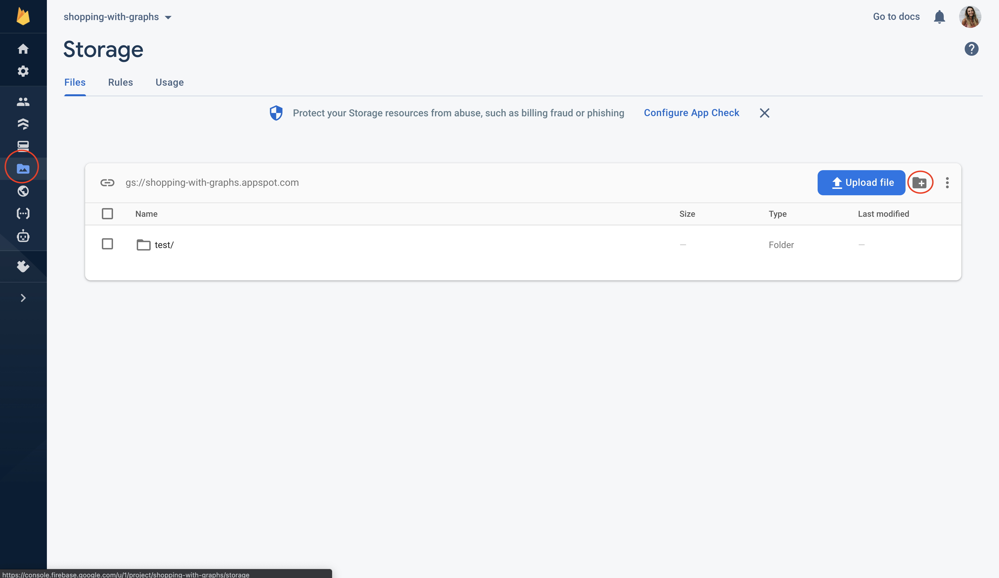
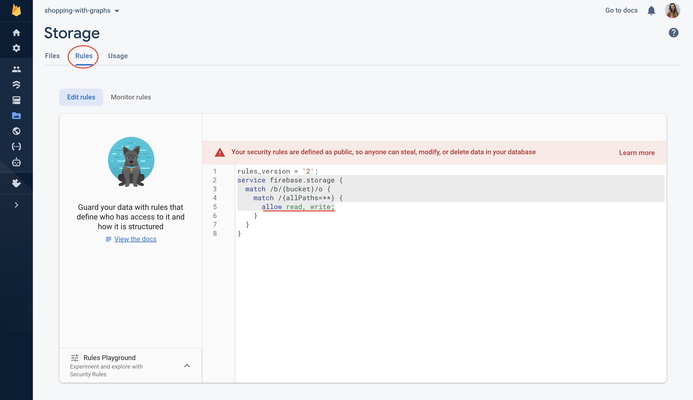

## Why Firebase Storage?

Cloud Storage for Firebase is built for app developers who need to store and serve user-generated content, such as photos or videos. It is a cost-effective storage solution. The use of the Firebase SDKs allows us to store and upload images, audio, and other user-generated content, and the Google Cloud Storage APIs are used to access these files.

For our use case, we'd like to store product images in the Cloud Storage which will be accessed through Flutter. 

*Again, [here](https://firebase.google.com/docs/storage/web/start) is the Firebase documentation for getting started with web storage with Firebase.*

## Getting start with Firebase Storage

Let's begin by getting our Firebase storage ready!

Go to your project dashboard on Firebase Console, select “Storage” from the left-hand menu then you can see the bucket path as shown in the screenshot below:

I have created a folder called `test` to hold all the image files for this project. You don’t have to manually add the path to your Flutter code because it will be handled automatically by Firebase packages.

For simplicity’s sake, we will NOT implement authentication in this example. Therefore, we need to change the rules for Firebase Storage to be public, like this:

