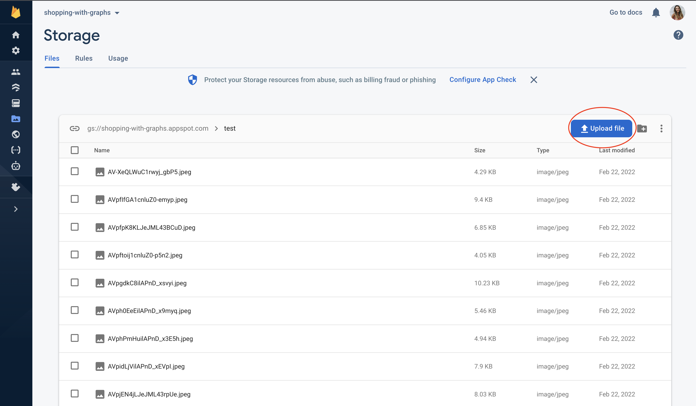

Prior to uploading the images, they must be gathered first! To do so, I searched each product in our database and saved each from online. In a real use case, you should already have the image assets to upload. 

We can then hit the 'Upload File' button to add images to the selected folder.

**IMPORTANT NOTE: The name of each image you upload is very, very important! To correctly populate images based off user search and endpoint calls, each image should be names with the image id as shown below.**

