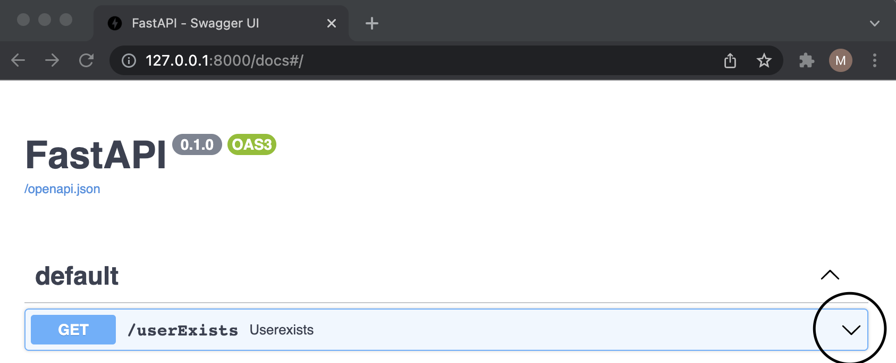
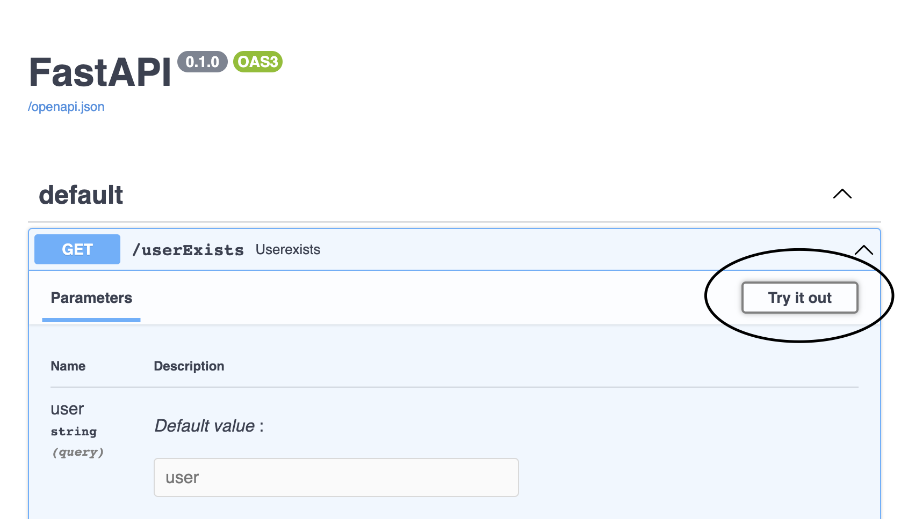
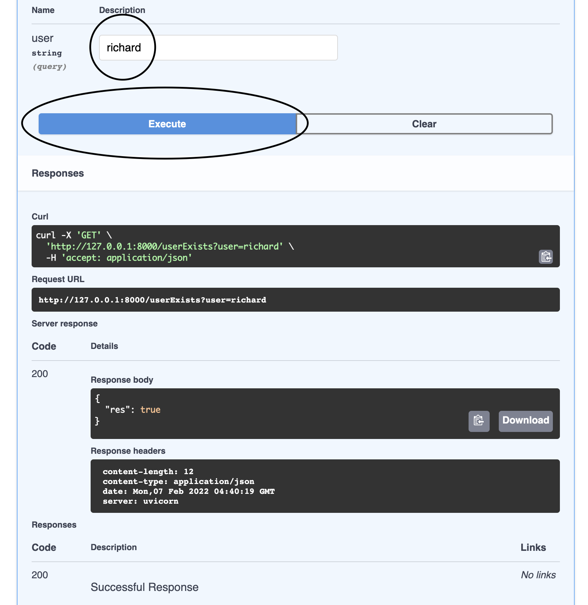
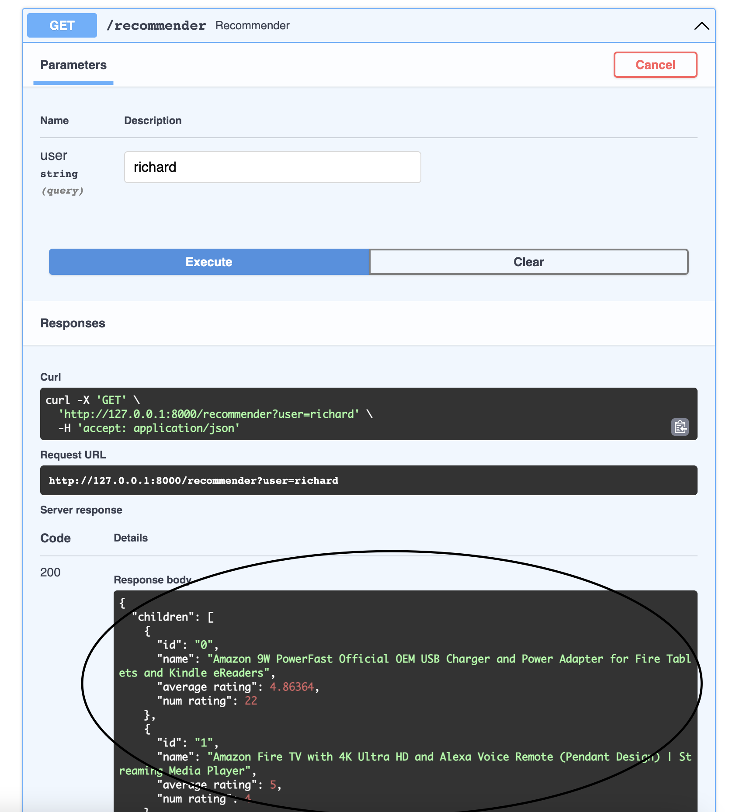

Now that we have our environment set up, our TG solution established, and our queries installed and ready to be utilized, let's set up our middleware!

* Note: you should import our [compressed graph](https://github.com/mckenzie-steenson/amazon-app/blob/master/export_124632584.tar.gz) before following the middleware and frontend steps so you have the exact schema and queries in the tutorial!! 

## Connect to your TigerGraph Solution

Open `main.py` in your `middleware` directory and import pyTigerGraph and configs. configs is going to be out configuration file for our TG solution credentials.

```python
import pyTigerGraph as tg
import configs as Credential
```

Now create a new `configs.py` file in the middle folder and import the TG credentials you created your solution with as shown below.

```python
HOST='https://flutter-app.i.tgcloud.io'
USERNAME='tigergraph'
PASSWORD='password'
GRAPHNAME='productGraph'
```

Back in the `main.py` file, create a connection to your TG Cloud server using pyTigerGraph. 

```python
conn = tg.TigerGraphConnection(host=Credential.HOST, username=Credential.USERNAME, password=Credential.PASSWORD, graphname=Credential.GRAPHNAME)
conn.apiToken = conn.getToken(conn.createSecret())
```
*Check out the [pyTigerGraph documentation](https://pytigergraph.github.io/pyTigerGraph/GettingStarted/).*

Save the `main.py` and `configs.py` files, and if it runs and reloads successfully, then you are connected to TG Cloud!

## Establish Cross-Origin Resource Sharing (CORS)

Since a port is not specified, CORS configuration is essential.

Import CORSMiddleware in the `main.py` file.

```python
from fastapi.middleware.cors import CORSMiddleware
```

Create allowed origins (none in this case).

```python
origins = ["*"]
```

Specify what the middleware allows:

* Credentials
* HTTP methods
* HTTP headers

```python
app.add_middleware(
   CORSMiddleware,
   allow_origins=origins,
   allow_credentials=True,
   allow_methods=["*"],
   allow_headers=["*"],
)
```

## Create Query Endpoints

Let's first run the TigerGraph queries with FastAPI, starting with our userExists query.

```python
@app.get('/userExists')
def userExists(user: Optional[str] = ""):
  try:
     res = conn.runInstalledQuery("userExists", {"id": user})[0]["Res"] != []
     return {"res": res}
  except:
     return {"msg": "Uh oh! There's an error!"}
```

This runs the userExists query that was installed in GraphStudio. The query parameter takes the User ID, the output returns correctly if the user does exist, and returns nothin if the user does not exist.

Test out the query call! Save the new changes in your `main.py` file and open [127.0.0.1:8000/docs](127.0.0.1:8000/docs), and click the drop down arrow to try out the userExists endpoint.



Click the 'Try it out' button.



Enter a valid user from the Amazon data and hit the 'Execute' button. If your input does not match any user from in the product data, you will get an error message returned to you. My go to is 'richard'. If you input 'richard', your result in the response body should be true. 



Let's now move to the Recommender Query. This requires a little bit more work. The data needs to be transformed into a nested tree in json format with keys like "id" or "name" and children of the list of objects that are associated with the keys.

```python
@app.get('/recommender')
def recommender(user: Optional[str] = ""):
  try:
     gQuery = conn.runInstalledQuery("recommender", {"input": user})[0]["result"]
     count = 0
     children = []
     for p in gQuery:
        children.append({
           "id": str(count),
           "name": p["attributes"]["result.name"],
           "average rating": p["attributes"]["result.@avgRating"],
           "num rating": p["attributes"]["result.@numRating"]
        })
        count+=1
     result = {
        "children": children,
     }
     return result
    
  except:
     return {"msg": "Uh oh! There's an error!"}
```

Test out the Recommender endpoint the same way as the userExists query! Hit the drop down menu next to the endpoint name and execute a user name from the Amazon data. With a 200 success reponse, you should see the JSON format matches the key/children format we used in the code above.



## Complete Code Sample
After implementing the productExists query, your completed `main.py` should look like this:

```python
from typing import Optional
from fastapi import FastAPI
from fastapi.middleware.cors import CORSMiddleware
import pyTigerGraph as tg
import configs as Credential

conn = tg.TigerGraphConnection(host=Credential.HOST, username=Credential.USERNAME, password=Credential.PASSWORD, graphname=Credential.GRAPHNAME)
conn.apiToken = conn.getToken(conn.createSecret())

app = FastAPI()

origins = ["*"]

app.add_middleware(
    CORSMiddleware,
    allow_origins=origins,
    allow_credentials=True,
    allow_methods=["*"],
    allow_headers=["*"],
)

@app.get('/userExists')
def userExists(user: Optional[str] = ""):
   try:
      res = conn.runInstalledQuery("userExists", {"id": user})[0]["Res"] != []
      return {"res": res}
   except:
      return {"msg": "Uh oh! There's an error!"}

@app.get('/productExists')
def productExists(product: Optional[str] = ""):
   try:
      res = conn.runInstalledQuery("productExists", {"id": product})[0]["Res"]
      return {"res": res[0]["attributes"]}
   except:
      return {"msg": "Uh oh! There's an error!"}

@app.get('/recommender')
def recommender(user: Optional[str] = ""):
   try:
      gQuery = conn.runInstalledQuery("recommender", {"input": user})[0]["result"]
      count = 0
      children = []
      for p in gQuery:
         children.append({
            "id": str(count),
            "name": p["attributes"]["result.name"],
            "average rating": p["attributes"]["result.@avgRating"],
            "num rating": p["attributes"]["result.@numRating"]
         })
         count+=1
      result = {
         "children": children,
      }
      return result
      
   except:
      return {"msg": "Uh oh! There's an error!"}
```
**IMPORTANT NOTE**: Don't forget that your TG solution should be started and running before API requests can be established through FastAPI and Flutter! Go to the [TigerGraph Cloud](tgcloud.md) page to set up your TG solution if you have not already done so. 