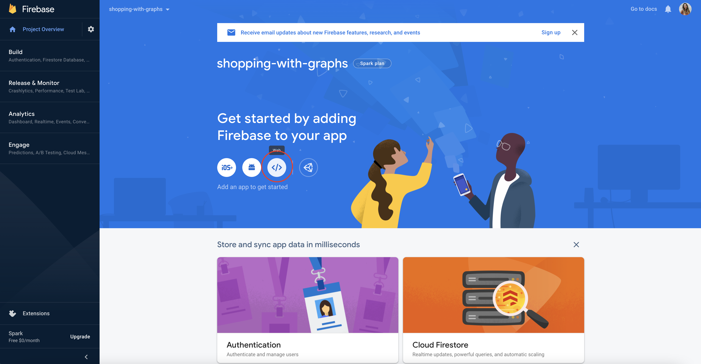
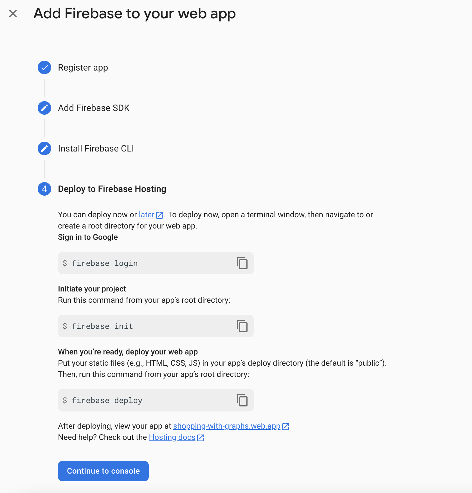
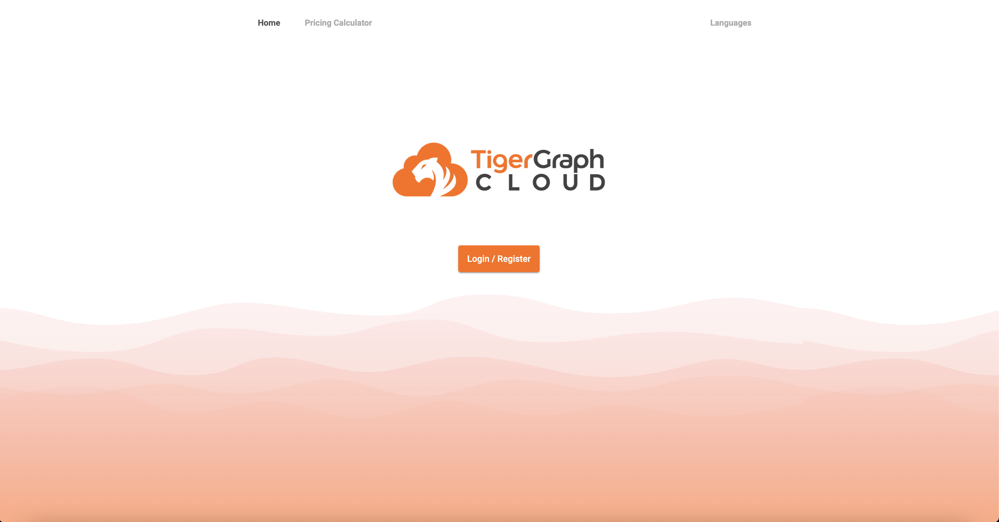
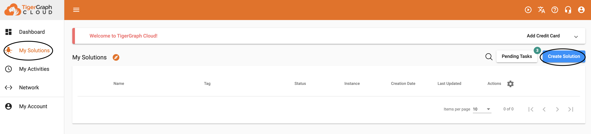
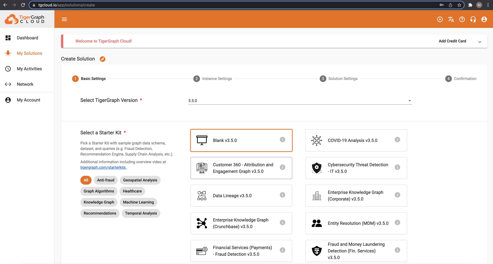
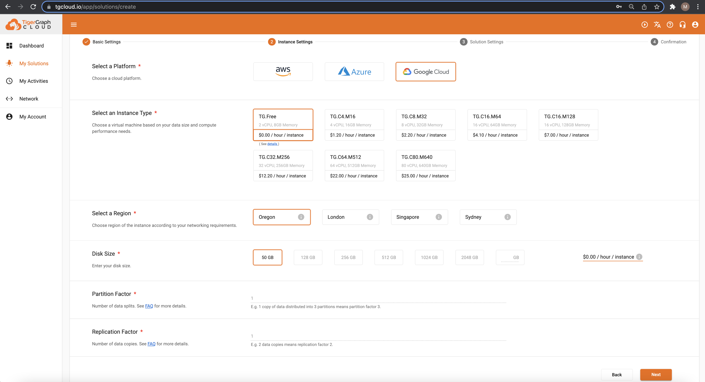
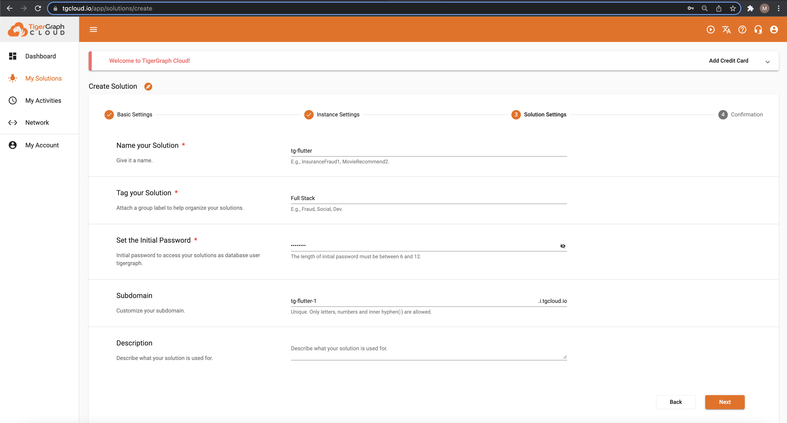
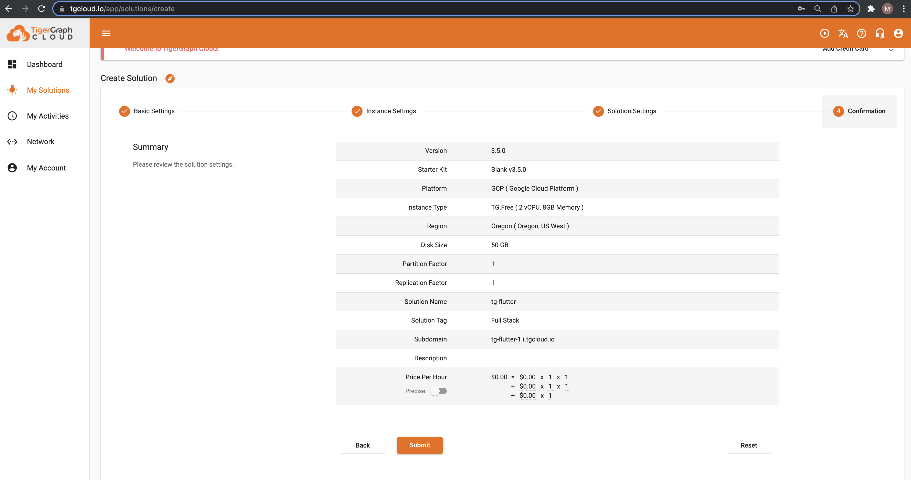
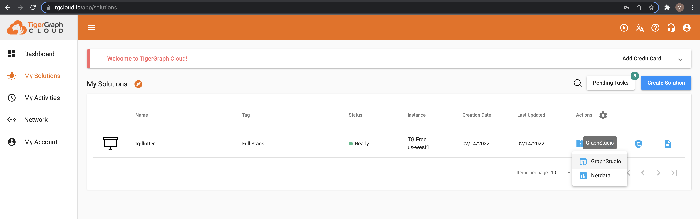

So to begin setting up our environment, let's start by creating a project folder in a desired location that will hold the contents of our project. Name it `my-project`.

```
mkdir my-project
```
```
cd my-project
```

## Flutter
Now, to create a Flutter project, we first must fulfill the Flutter Requirements needed:

* Flutter SDK
* Chrome
* Optional: an IDE that supports Flutter. Visual Studio Code is used for this tutorial

Follow the [Building a Web Application with Flutter](https://docs.flutter.dev/get-started/web) tutorial to get your machine set up with the Flutter SDK.

**IMPORTANT NOTE**: The instructions provided by the Flutter Docs only sets your PATH variable for the current terminal window and not for future terminal windows. Follow [these](https://stackoverflow.com/questions/50652071/flutter-command-not-found) instructions to permanently add Flutter to your path. 

### Create a new Flutter project with web support

Run the following commands to get the latest version of Flutter

```
flutter channel stable
```
```
flutter upgrade
```

And create and run a new Flutter project within the my-project directory. I named my flutter project `tg_flutter`.

```
mkdir my-project
```
```
cd my-project
```
```
flutter create tg_flutter
```
```
cd tg_flutter
```

Serve your app from localhost in Chrome by running the following command from the main directory of the project, `tg_flutter`.

```
flutter run -d chrome
```

This launches the application using the development compiler in the Chrome browser.

## Middleware

Requirements

* [Python](https://www.python.org/downloads/)
* [pip](https://pip.pypa.io/en/stable/installation/)

## Create Middleware Directory

In the `my-project` directory, create a new directory to hold the goods for the middleware.

```
mkdir middleware
cd middleware
```

Your `middleware` and `tg_flutter` directories should sit next to each other in the `my-project` directory.

### Python Virtual Environment

Create a virtual environment using venv and Python.

```
python3 -m venv venv
```

Activate the new virtual environment.

```
source venv/bin/activate
```

There should now be (venv) in front of your terminal after activating the virtual environment. 

### Install Packages

For the middleware, we will be using pyTigerGraph, FastAPI, and a library called uvicorn that is used by FastAPI

```
pip install pyTigerGraph fastapi uvicorn
```

*[What is FastAPI?](https://fastapi.tiangolo.com/)*

### FastAPI Setup

Open the `my-project` directory in VS Code or your editor of choice, open the `middleware` folder, and create a file called `main.py` inside of it.

Click into `main.py` and use code from FastAPI in that file.

```python
from typing import Optional
from fastapi import FastAPI

app = FastAPI()
@app.get("/")
def read_root():
    return {"Hello": "World"}
```

### Run the API

Save `main.py`, open an integrated terminal in VS Code, and run the following command to run the API.

```
uvicorn main:app --reload
```

This is using uvicorn to run our file. The file name is `main` and the `--reload` has the server automatically relaod after new changes are saved to the `main.py` file.

### Explore the Endpoints

Now it's time to check out the endpoints that were just created! Enter [https://127.0.0.1:8000](https://127.0.0.1:8000) in a browser page, and here you should find the {“Hello”: “World”} from the first function in the `main.py` file

Enter [http://127.0.0.1:8000/docs](http://127.0.0.1:8000/docs) or [http://127.0.0.1:8000/redoc](http://127.0.0.1:8000/redoc) to find interactive documentation for the endpoints we created. Thanks fastAPI!

## Firebase

Sign into Firebase using your Google account and follow the linked Google documentation to get started! In this section, the specfiic SDKs will be configured for our project.

### Create Firebase Project
Once you have [Created your Firebase Project](https://firebase.google.com/docs/web/setup#create-project), you will be able to [Register your project](https://firebase.google.com/docs/web/setup#register-app)!

This is an example of my registration process:




### Add Firebase SDKs
The only way to currently add the Firebase SDKs to your Flutter web project is by importing the scripts from the Firebase content delivery network (CDN). Inside the `tg_flutter` project folder, located the `index.html` file. Add the `firebase-app.js` script to your `index.html` file:

```html
<html>
  ...
  <body>
    <!-- Add these lines -->
    <script>window.flutterfire_web_sdk_version = '8.10.0';</script>
    <script src="https://www.gstatic.com/firebasejs/8.10.0/firebase-app.js"></script>
    <script src="https://www.gstatic.com/firebasejs/8.10.0/firebase-analytics.js"></script>
    <script src="https://www.gstatic.com/firebasejs/8.10.0/firebase-firestore.js"></script>
    <script src="https://www.gstatic.com/firebasejs/8.10.0/firebase-storage.js"></script>
    <!-- Add ^ lines -->
    <script src="main.dart.js" type="application/javascript"></script>
  </body>
</html>
```
### Initializing Firebase
The next step is to initialize Firebase using your project configuration. Create a new web app (or choose an existing one) on the Firebase Console and copy the configuration details.

Initialize Firebase using these configuration details, placing the following script below the CDN imports added above:

```html
<html>
  ...
  <body>
    <script src="https://www.gstatic.com/firebasejs/8.10.0/firebase-app.js"></script>
    ...

    <!-- Firebase Configuration -->
    <script>
      var firebaseConfig = {
        apiKey: "...",
        authDomain: "[YOUR_PROJECT].firebaseapp.com",
        databaseURL: "https://[YOUR_PROJECT].firebaseio.com",
        projectId: "[YOUR_PROJECT]",
        storageBucket: "[YOUR_PROJECT].appspot.com",
        messagingSenderId: "...",
        appId: "1:...:web:...",
        measurementId: "G-...",
      };

      // Initialize Firebase
      firebase.initializeApp(firebaseConfig);
    </script>

  </body>
</html>
```

Once you've followed the Firebase setup documentation and implemented the above code, your environment should be setup to begin working with Firebase!
<!-- ## TigerGraph Cloud

### Create your Solution

Navigate to [TigerGraph Cloud] and create an account if you haven't already.



Once logged in, navigate to the "My Solutions" tab. Next, press the blue "Create Solution" button.



We will using a blank starter kit!



The rest of the settings will not need to be changed, scroll down, and press "Next".



Customize the third page best to best describe your graph. Keep note of and maybe write down your password and subdomain. We will need these later when using pyTigerGraph. Once you are satisfied with your Solution Settings, press "Next".



Review your options on the final page, and if all looks good, press "Submit".



It may take a few minutes for your solution to be ready to start. You can check the status of your solution by pressing "Pending Tasks" in the top right corner of your screen. And once the solution is ready, you can click the square with dials in it, "Solution Operations, under "Actions" to start and stop your solution!

 -->