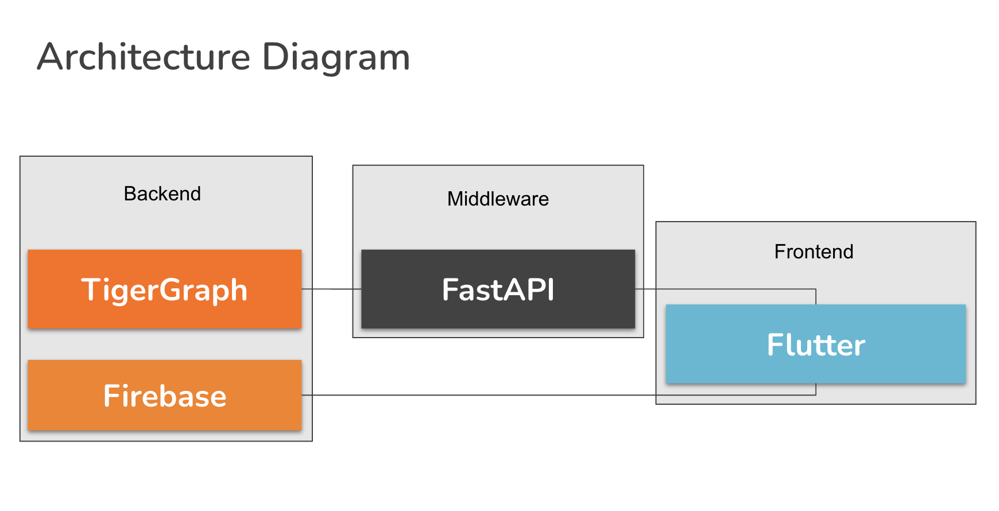
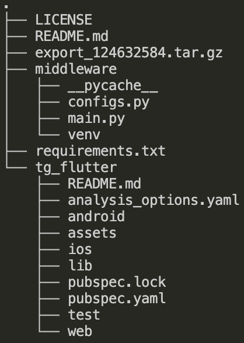

## Fundamentals to Downlaod

- Create a [Github](https://github.com/) account if you don’t already have one 
- Install an IDE: we recommend [vscode](https://code.visualstudio.com/)
- Make sure your computer has Python installed by typing the following in your mac terminal or windows powershell. 

```py
python --version
```

*Visit [Python documentation](https://www.python.org/about/gettingstarted/) for more information.*

## Optional Preparation:

- Review GSQL 101:
    - [Documentation](https://docs.tigergraph.com/gsql-ref/current/tutorials/gsql-101/)
    - [TigerGraph Certification](https://www.tigergraph.com/certification/tigergraph-certification-gsql-101/)

Continue to the Environment Setup to get started with TigerGraph, FastAPI, Flutter and Firebase!



Once you have completed the project, the organization of files should look something like the below file tree.


