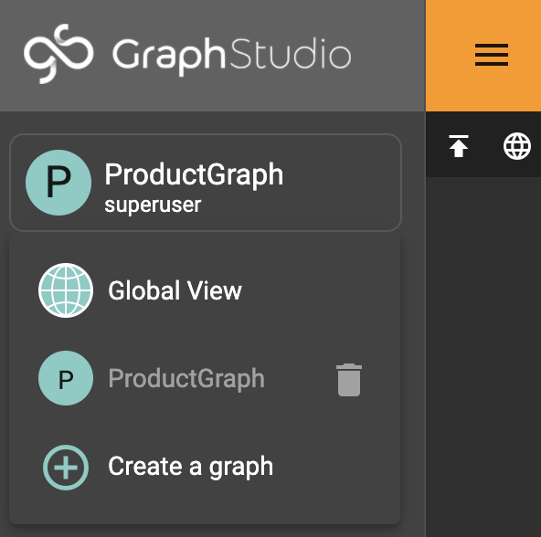
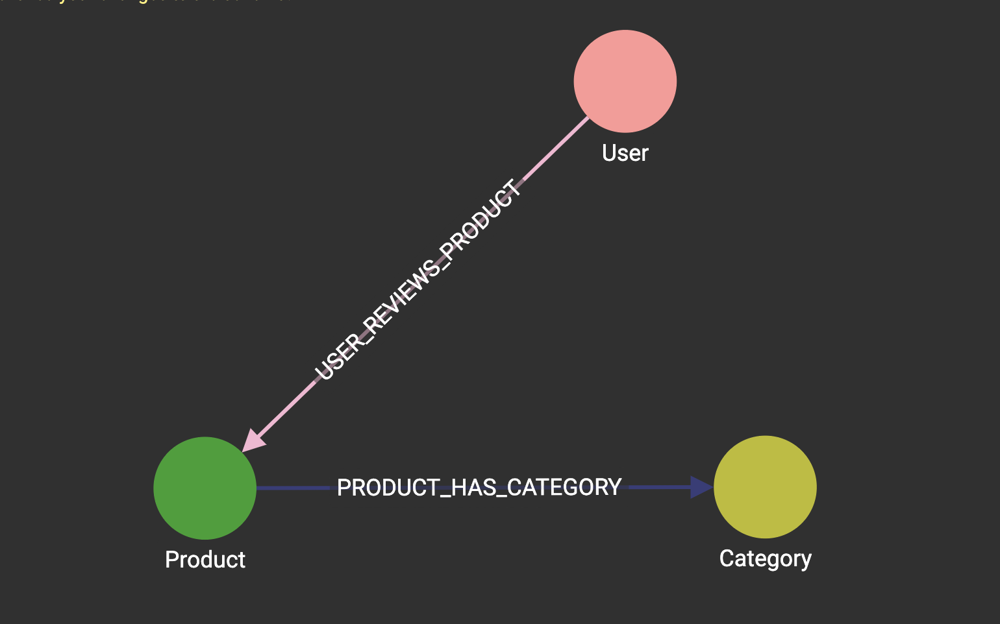

# GraphStudio 
### Graph Schema 
1. When your solution is done (pending tasks complete), hover over the symbols under actions to see the solutions operation icon and start your solution. Click the Applications icon and enter GraphStudio.
2. You should be in the Global View. Click that name on the left and create a graph: we named ours ProductGraph. 

3. Design your graph schema based on the [Amazon Product review data](https://kristinezhengx.github.io/amazon-app-site/dataworld/#pandas) by adding vertex, edge types, and their corresponding attributes. For our purposes, be sure to click Directed for edges between vertices so you can create the reverse edge at the same time. 

4. Final schema!

### Map and Load Data

### Explore Graph
