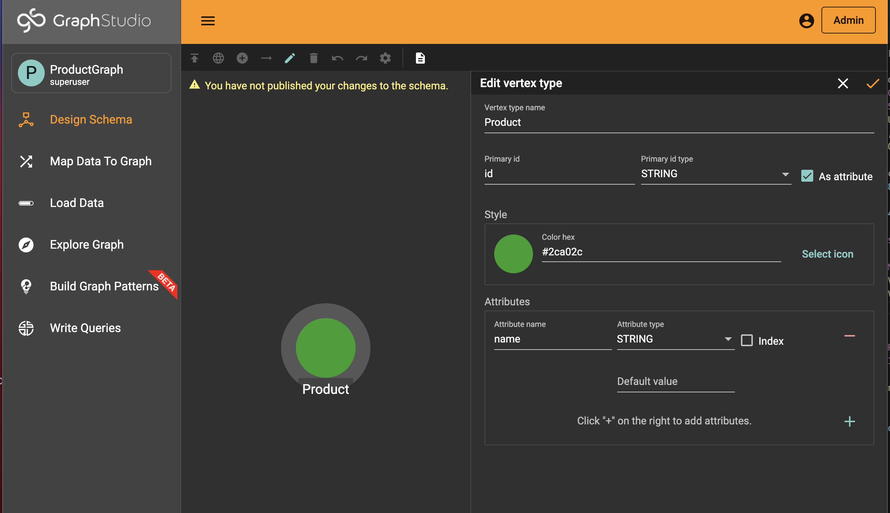
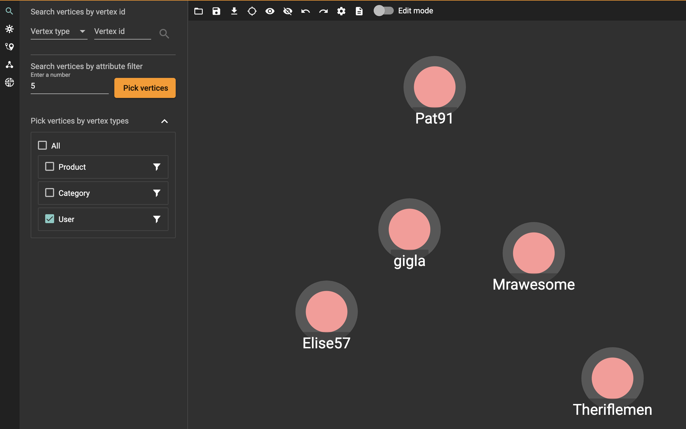

# GraphStudio 
### Graph Schema 
1. When your solution is done (pending tasks complete), hover over the symbols under actions to see the solutions operation icon and start your solution. Click the Applications icon and enter GraphStudio.
2. You should be in the Global View. Click that name on the left and create a graph: we named ours ProductGraph. 

3. Design your graph schema based on the [Amazon Product review data](https://kristinezhengx.github.io/amazon-app-site/dataworld/#pandas) by adding vertex, edge types, and their corresponding attributes. 

For our purposes, be sure to click directed for edges between vertices so you can create the reverse edge at the same time. 

4. Final schema! Remember to save! 

### Map and Load Data
1. Upload the cleaned [data](https://kristinezhengx.github.io/amazon-app-site/dataworld/#pandas) and check has header box and confirm the formatting.

2. Hover over the symbols bar and click the arrows for "map datafile to vertex or edge." Then you can start mapping the data corrresponding to graph vertex and edge information. 

3. Publish data mapping
4. Click start and load data. Check if your stats look similar to ours:

### Explore Graph
You can pick vertices to explore by type or id. Double click on a vertex to expand its edges and neighbor vertices. Hovering over a vertex or edge will review more details and attributes and click hide (crossed out eye) to clear your screen without deleting from your graph. 

Now you are all set with your graph schema! Move onto queries to analyze data and use your graph! 
