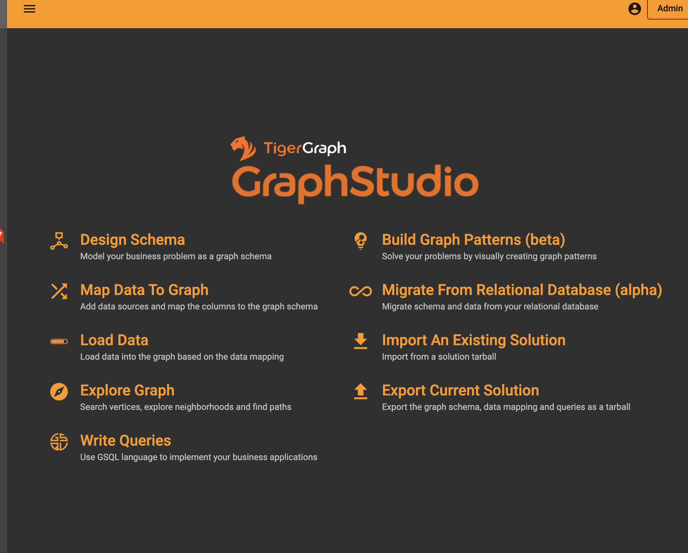

# Importing and exporting your solution

## Export

* If you wish to save your graph schema and queries as a compressed file, click export current solution. 

## Import 
* Click import an existing solution to import a compressed solution

* Note: you should import our [compressed graph](https://github.com/mckenzie-steenson/amazon-app/blob/master/export_124632584.tar.gz) before following the middleware and frontend steps so you have the exact schema and queries in the tutorial!!  
 

