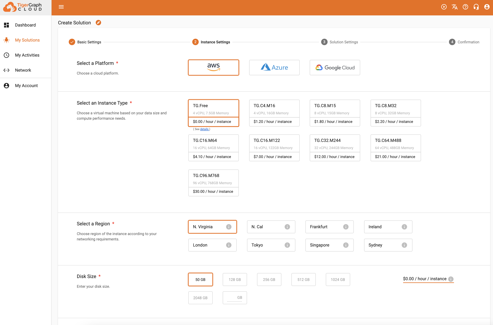
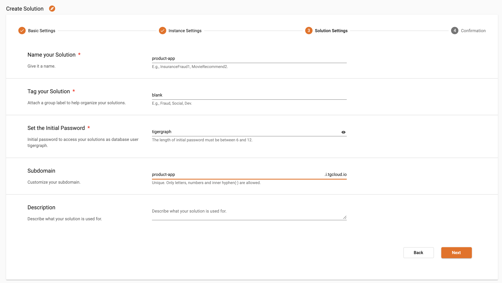
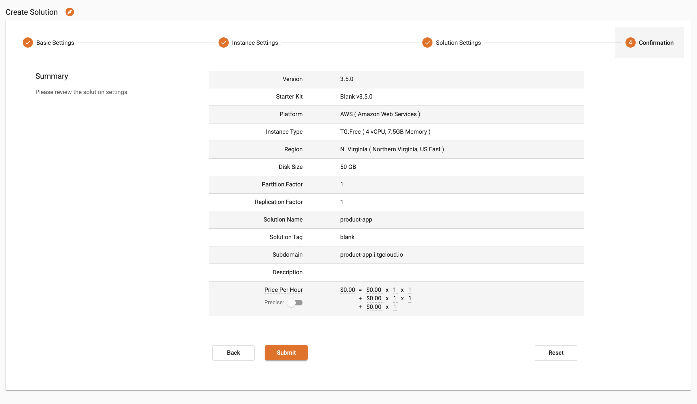

# Setting up TGcloud 

## Creating a Solution
1. Create a free account on [tgcloud.io](https://tgcloud.io/) if you don't already have one. 
2. Navigate to My Solutions and click Create Solution in the right corner. Note: you can only have one free tier solution at a time. 
3. Keep the default Blank kit and AWS platform. See the pictures below. 

4. Name your solution and subdomain, and set your password. This is what we wrote:

5. Submit your solution!

